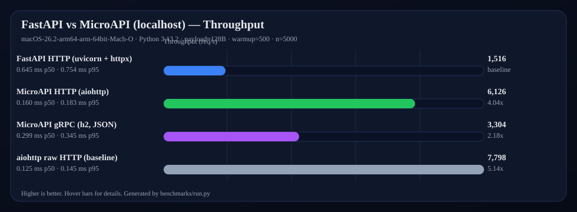

# MicroAPI

[](https://pypi.org/project/microapi/)
[](https://www.python.org/downloads/)
[](https://opensource.org/licenses/MIT)

**MicroAPI** is a Python microservices framework that lets your services communicate as if calling regular Python functions. Built with a **FastAPI-like** interface, full **Pydantic** typing, and multiple transport backends.

```python
from microapi import MicroAPI, Service, Schema
from microapi.transport.http import HTTPTransport

class User(Schema):
    username: str
    age: int = 0

service = Service("users")

@service.method
async def get_user(payload: GetUserPayload) -> User:
    return User(username="alice", age=30)

app = MicroAPI(services=[service])
app.run(transport=HTTPTransport(port=8080), auto_generate_lib=True)
```

On the client side, the auto-generated library gives you **full IDE autocompletion**:

```python
from lib import users
from microapi.client.base import Connection
from microapi.transport.http import HTTPTransport

async with Connection(HTTPTransport(port=8080).create_client()) as conn:
    user = await users.get_user(user_id=1)   # fully typed!
    print(user.username)                       # IDE knows this is str
```

## Benchmarks (FastAPI vs MicroAPI)

We run **real localhost benchmarks** (network stack included) comparing:
- **FastAPI over HTTP** (`uvicorn` + `httpx`, `ORJSONResponse`)
- **MicroAPI over gRPC** (custom HTTP/2 `h2` transport, JSON envelopes)

Plus two extra baselines:
- **MicroAPI over HTTP** (aiohttp transport)
- **raw aiohttp** (minimal handler, no framework features)

To reproduce:

```bash
uv sync --extra bench --extra http --extra grpc
uv run python -m benchmarks.run
```

_Results vary by machine/OS/Python. The table below is generated by `benchmarks/run.py`._

<p align="center">
  
</p>

<!-- BENCHMARKS:START -->
| Benchmark | Requests | Total (s) | Req/s | p50 (ms) | p95 (ms) |
|---|---:|---:|---:|---:|---:|
| FastAPI HTTP (uvicorn + httpx) | 5,000 | 3.298 | 1,516 | 0.645 | 0.754 |
| MicroAPI HTTP (aiohttp) | 5,000 | 0.816 | 6,126 | 0.160 | 0.183 |
| MicroAPI gRPC (h2, JSON) | 5,000 | 1.513 | 3,304 | 0.299 | 0.345 |
| aiohttp raw HTTP (baseline) | 5,000 | 0.641 | 7,798 | 0.125 | 0.145 |
<!-- BENCHMARKS:END -->

**Run details**: `macOS-26.2-arm64-arm-64bit-Mach-O`, Python 3.13.2, localhost, unary `echo` RPC, payload \(\approx 128\) bytes, warmup=500, n=5000.  
See [`benchmarks/README.md`](benchmarks/README.md) for methodology and how to reproduce.

## Key Features

| Feature | Description |
|---------|-------------|
| **FastAPI-like Interface** | `@service.method` decorator, Pydantic schemas, dependency injection |
| **5 Transports** | gRPC (custom h2), HTTP, WebSocket, Kafka, RabbitMQ |
| **4 RPC Patterns** | Unary, server streaming, client streaming, bidirectional |
| **Auto Code Generation** | Typed Python client libraries + `.proto` files |
| **Middleware** | Composable middleware chain with full request/response access |
| **Dependency Injection** | `Depends()` with caching, async support, request access |
| **CLI Tool** | `microapi run`, `microapi generate`, `microapi init`, `microapi info` |
| **Hot Reload** | Auto-restart on file changes during development |
| **Type Safe** | Full Pydantic validation + generated client code with type hints |

## Installation

```bash
pip install microapi            # Core framework
pip install microapi[http]      # + HTTP transport (aiohttp)
pip install microapi[grpc]      # + gRPC transport (h2-based)
pip install microapi[ws]        # + WebSocket transport
pip install microapi[kafka]     # + Apache Kafka transport
pip install microapi[rabbitmq]  # + RabbitMQ transport
pip install microapi[all]       # Everything
```

## Quick Start

See the full [Getting Started Guide](docs/getting-started.md) for a complete walkthrough.

### 1. Define schemas and a service

```python
# schemas.py
from microapi import Schema

class UserPayload(Schema):
    user_id: int

class User(Schema):
    username: str
    age: int = 0
```

```python
# service.py
from microapi import Service, types
from schemas import UserPayload, User

service = Service("users")

@service.method
async def get_user(payload: UserPayload) -> User:
    return User(username="alice", age=30)

@service.method
async def list_users(payload: UserPayload) -> types.Streaming[User]:
    for user in await fetch_all_users():
        yield user
```

### 2. Run the server

```python
# main.py
from microapi import MicroAPI
from microapi.transport.http import HTTPTransport
from service import service

app = MicroAPI(services=[service])
app.run(
    transport=HTTPTransport(host="0.0.0.0", port=8080),
    auto_generate_lib=True,
    generated_lib_dir="lib",
)
```

### 3. Use the auto-generated client

```python
import asyncio
from lib import users
from microapi.client.base import Connection
from microapi.transport.http import HTTPTransport

async def main():
    transport = HTTPTransport(host="127.0.0.1", port=8080)
    async with Connection(transport.create_client()) as conn:
        user = await users.get_user(user_id=1)
        print(user.username)  # IDE autocomplete works!

asyncio.run(main())
```

## Documentation

| Page | Description |
|------|-------------|
| [Getting Started](docs/getting-started.md) | Installation, first project, step-by-step tutorial |
| [Services & Methods](docs/services.md) | Defining services, method patterns, schemas |
| [Transports](docs/transports.md) | HTTP, gRPC, WebSocket, Kafka, RabbitMQ configuration |
| [Streaming](docs/streaming.md) | All 4 RPC patterns with detailed examples |
| [Middleware](docs/middleware.md) | Middleware chain, ordering, short-circuiting |
| [Dependencies](docs/dependencies.md) | `Depends()`, caching, request access, async deps |
| [Code Generation](docs/code-generation.md) | Python client library + Protobuf generation |
| [CLI Reference](docs/cli.md) | All CLI commands and options |
| [Lifecycle](docs/lifecycle.md) | Startup/shutdown hooks, lifespan context managers |
| [Architecture](docs/architecture.md) | Wire protocol, design decisions, project structure |
| [API Reference](docs/api-reference.md) | All public classes, methods, and types |
| [Examples](docs/examples.md) | Complete working examples for all features |

## RPC Patterns at a Glance

```python
# Unary: request → response
@service.method
async def get_user(payload: GetUserPayload) -> User: ...

# Server streaming: request → stream of responses
@service.method
async def list_users(payload: ListPayload) -> types.Streaming[User]: ...

# Client streaming: stream of requests → response
@service.method
async def add_users(stream: types.Stream[User]) -> Result: ...

# Bidirectional: stream ↔ stream
@service.method
async def chat(stream: types.Stream[Message]) -> types.Streaming[Reply]: ...
```

## Transport Comparison

| Transport | Protocol | Streaming | Latency | Use Case |
|-----------|----------|-----------|---------|----------|
| **gRPC** | HTTP/2 | Full | Low | Internal microservices |
| **HTTP** | HTTP/1.1 | Server only | Medium | REST-like APIs, web clients |
| **WebSocket** | WS | Full | Low | Real-time, persistent connections |
| **Kafka** | TCP | Server | High | Event-driven, high throughput |
| **RabbitMQ** | AMQP | Server | Medium | Task queues, reliable delivery |

## Development

```bash
git clone https://github.com/BiqRed/MicroAPI.git
cd MicroAPI
uv sync --all-extras
uv run pytest tests/ -v       # Run tests
uv run ruff check microapi/   # Lint
uv run mypy microapi/         # Type check
```

## License

MIT
